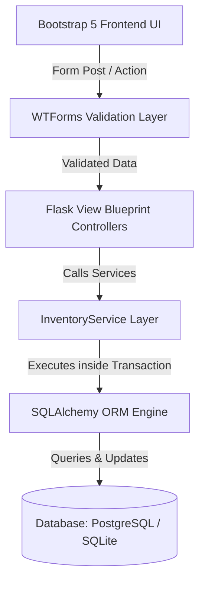

# Gokul Cycle & Tyre - Inventory Management System (Operations & Details)

This document provides a detailed breakdown of the internal mechanics, calculations, logic layers, database constraints, security checks, and operational procedures implemented within the Inventory Management System.

---

## 1. Core Architecture & Workflow Layers

The application is built using a three-tier software architecture:

1. **Presentation Layer (Frontend):** 
   * Responsive HTML5 templates styled using Bootstrap 5 and custom CSS layouts.
   * Interactive components, modal dialogs, and validation feedback.
   * Data visualization dashboards powered by Chart.js.
2. **Business Logic & Service Layer (Backend):**
   * Flask blueprints grouping related routing actions.
   * WTForms layer handling input validation, cross-field checks, and CSRF protection.
   * `InventoryService` module executing atomic database queries within transactional scopes.
3. **Data Persistence Layer (Database):**
   * SQLAlchemy ORM managing relationships and schema definitions.
   * PostgreSQL database for production deployments.
   * Automatic SQLite local fallback for development environments.



---

## 2. Detailed Database Design & Constraints

The system models its entities using the following database schema structures.

### A. User Entity (`users` table)
Stores identity information, hashed authentication keys, and access roles:
* `id` (Integer, Primary Key): Unique row identifier.
* `username` (String(64), Unique, Indexed, Not Null): Login name.
* `password_hash` (String(256), Not Null): Hashed string generated using `generate_password_hash` (Werkzeug Security).
* `role` (String(20), Not Null, Default='STAFF'): Access level controls. Either `'ADMIN'` or `'STAFF'`.
* `created_at` (DateTime, Default=UTC): Timestamp of account creation.

### B. Product Entity (`products` table)
Maintains the master catalog database of cycles, tyres, tubes, rims, parts, and accessories:
* `id` (Integer, Primary Key): Unique row identifier.
* `product_code` (String(50), Unique, Indexed, Not Null): Master SKU reference (e.g. `HERO-CYC-26`).
* `name` (String(100), Not Null): Descriptive name.
* `brand` (String(50)): Manufacturer.
* `category` (String(50), Not Null): One of: `Cycle`, `Tyre`, `Tube`, `Rim`, `Spare Part`, `Accessory`.
* `size` (String(50)): Dimensions.
* `purchase_price` (Numeric(10, 2), Not Null): Wholesale catalog purchase cost.
* `selling_price` (Numeric(10, 2), Not Null): Retail shelf price.
* `minimum_stock` (Integer, Default=10, Not Null): Stock alarm threshold.
* `description` (Text): Details.
* `image` (String(255)): Name of the uploaded thumbnail image file.
* `is_active` (Boolean, Default=True, Not Null): Used to implement soft deletion. If `False`, the item is hidden from standard views.
* `created_at` & `updated_at` (DateTime): Auditing timestamps.

### C. Location Entity (`locations` table)
Models inventory storage nodes:
* `id` (Integer, Primary Key): Unique row identifier.
* `name` (String(100), Unique, Not Null): Display name of storage (e.g., `Main Godown`).

### D. Inventory Entity (`inventory` table)
Maintains stock counts per product per location:
* `id` (Integer, Primary Key): Unique row identifier.
* `product_id` (Integer, Foreign Key pointing to `products.id`, Not Null).
* `location_id` (Integer, Foreign Key pointing to `locations.id`, Not Null).
* `quantity` (Integer, Default=0, Not Null): The stock level.
* **Unique Constraint:** `UniqueConstraint('product_id', 'location_id')` ensures only a single row exists for a product at a given location.
* **Check Constraint:** `CheckConstraint('quantity >= 0')` guarantees the database engine will raise an integrity error if an operation attempts to decrease a stock count below zero.

### E. Transaction Entity (`transactions` table)
Read-only permanent audit log recording every single inventory update:
* `id` (Integer, Primary Key): Unique identifier.
* `product_id` (Integer, Foreign Key pointing to `products.id`, Not Null).
* `user_id` (Integer, Foreign Key pointing to `users.id`, Not Null): The user who processed the movement.
* `source_location_id` (Integer, Foreign Key pointing to `locations.id`, Nullable): Source of stock.
* `destination_location_id` (Integer, Foreign Key pointing to `locations.id`, Nullable): Target of stock.
* `quantity` (Integer, Not Null): Number of items moved.
* `transaction_type` (String(20), Not Null): Either `'STOCK_IN'`, or `'STOCK_OUT'`.
* `notes` (Text): Explanations, invoice lookup numbers, and vendor names.
* `created_at` (DateTime, Default=UTC): Audit timestamp.

---

## 3. Stock Movement Business Logic (InventoryService)

Stock mutations are encapsulated inside the `InventoryService` class to ensure transactional integrity and atomic updates.

### A. Stock In (Purchase)
* **Goal:** Increase stock for a product at a location.
* **Process:**
  1. Validates that quantity is greater than zero.
  2. Queries the product database. Verifies the product exists and is active.
  3. Queries the location database to verify target location exists.
  4. Attempts to load the existing `Inventory` row for the combination `(product_id, location_id)`.
  5. If the inventory row does not exist, inserts a new row with `quantity = 0`.
  6. Increments the inventory quantity by the received value.
  7. Formats notes to bundle the **Supplier Name** and **Invoice Number**.
  8. Inserts a new audit log row into the `transactions` table with:
     * `source_location_id = None`
     * `destination_location_id = location_id`
     * `transaction_type = 'STOCK_IN'`
  9. Commits the session. If any database exceptions are caught (e.g. communication failure), rolls back the session and throws an `InventoryException`.

### B. Stock Out (Sale / Adjustment)
* **Goal:** Deduct stock from a location.
* **Process:**
  1. Validates that quantity is greater than zero.
  2. Verifies the product exists and is active.
  3. Verifies the location exists.
  4. Loads the existing `Inventory` row for the combination.
  5. **Safety Guard:** If no inventory row is found, or if `inventory.quantity < requested_quantity`, aborts immediately and raises an `InventoryException("Insufficient stock")`. This prevents negative stock levels at the application level.
  6. Decrements the inventory quantity.
  7. Inserts a new audit log row into the `transactions` table with:
     * `source_location_id = location_id`
     * `destination_location_id = None`
     * `transaction_type = 'STOCK_OUT'`
     * `notes` containing the reason (e.g. Sold, Damaged, Theft).
  8. Commits the database session. If the database engine encounters an issue, rolls back to preserve consistency.


---

## 4. Role-Based Access Controls (RBAC) Mechanics

Authorization limits are enforced at the blueprint router level using custom filters and handlers.

```
       +---------------------------------------------+
       |             HTTP Request Route              |
       +---------------------------------------------+
                              |
                              v
                +---------------------------+
                |     @login_required       |
                +---------------------------+
                              |
                       [Is Logged In?]
                      /               \
                    Yes                No
                    /                    \
                   v                      v
      +-------------------------+    +--------------------------+
      |     @admin_required     |    | Redirect to /login page  |
      +-------------------------+    +--------------------------+
                    |
            [Is User an Admin?]
           /                   \
         Yes                    No
         /                        \
        v                          v
+-----------------------+    +--------------------------+
| Access Route Allowed  |    | Abort with 403 Forbidden |
+-----------------------+    +--------------------------+
```

### A. Route Guard Decorator (`@admin_required`)
Defined in `app/utils/decorators.py`:
```python
def admin_required(f):
    @wraps(f)
    def decorated_function(*args, **kwargs):
        if not current_user.is_authenticated or not current_user.is_admin():
            abort(403)
        return f(*args, **kwargs)
    return decorated_function
```
If a Staff member attempts to access an Admin-only URL (like `/users` or `/products/add`), the decorator intercepts the request and returns an HTTP `403 Forbidden` error.

### B. Admin Console Access Control
Flask-Admin views are secured using custom view classes that override security configurations:
* `is_accessible()` returns `True` only if `current_user.is_authenticated` and `current_user.role == 'ADMIN'`.
* `inaccessible_callback()` redirects unauthorized requests back to the login page with a warning message.

---

## 5. Dashboard Calculations & Feeds

The dashboard page uses SQLAlchemy query functions to calculate store status metrics:

1. **Total Products:** Counts active products in the database:
   $$\text{Total Active Products} = \text{Count of Products where } is\_active = True$$
2. **Total Inventory Quantity:** Sums all quantities:
   $$\text{Total Qty} = \sum (\text{Inventory.quantity}) \text{ for active products}$$
3. **Total Inventory Value:** Sums the valuation of assets based on cost:
   $$\text{Total Value} = \sum (\text{Inventory.quantity} \times \text{Product.purchase\_price})$$
4. **Low Stock Items:** Compares a product's stock in the Main Godown against its warning threshold:
   $$\text{Product Stock} = \text{Inventory.quantity}$$
   $$\text{Low Stock Count} = \text{Count of Products where Product Stock} \le \text{Product.minimum\_stock}$$

---

## 6. Reports & Export Engine

The reports center allows compilation of inventory summaries, stock movements, and low-stock items.

### A. PDF Export Structure (ReportLab)
Generates high-quality vector documents:
1. Creates a `SimpleDocTemplate` specifying letter dimensions and page margins.
2. Draws a document header detailing the report type and timestamp.
3. Renders dataset cells within Paragraph containers to wrap text and prevent overflow.
4. Tabulates the cell matrices into a ReportLab `Table` styled with headers, alternating light gray row backgrounds, and slate borders.

### B. Excel Export Structure (Pandas + Openpyxl)
Creates spreadsheet workbooks:
1. Loads database rows into a Python list of dictionaries.
2. Converts the list into a Pandas `DataFrame` using named headers.
3. Writes the dataframe to an in-memory binary byte-stream using `pandas.ExcelWriter` with the `openpyxl` engine.
4. Returns an HTTP response streaming the binary Excel file.

### C. CSV Export Structure
Converts rows to comma-separated fields:
1. Builds an in-memory `StringIO` buffer.
2. Uses the python `csv.writer` to output rows.
3. Returns a text response with a `Content-Disposition` attachment header.
